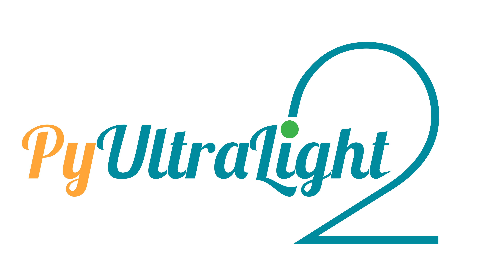

<center></center>

# Purpose of the Library, and Current Capabilities

To evolve a rigid N body particle ensemble and a mesh-based ULDM cluster in time, against an non-expanding background, with flexible settings, good energy-conservation, and easy expandability.

The main integrator is currently capable of generating 

* N body position and velocity state vectors, and
* ULDM density, gravitational field strength, momentum, angular momentum, and energy.

While the supplied auxillary functions can also produce

* System energy and entropy,
* N body orbital properties, and
* Estimates of dynamical friction force and related timescales.

The Jupyter notebooks shipped with the integrator contain a minimal analysis suite that is capable of plotting N body orbits, ULDM density contours and ULDM phases. In addition, a guide on how to save and process these files will be included in the later section.


# Known Issues

* In the current version, if you rely on the included generative functions to initialise your simulation, there is a chance that your x and y coordinates may be swapped. **Temporary Remedy:** Call ``PyUL.VizInit2D(length,length_units,resol,embeds,
              solitons,s_position_unit, s_mass_unit,
              particles,m_position_unit, Uniform, Density, UVel, rP, VScale = 1)`` to generate an 2D preview of the simulation grid.


# Python Library Prerequisites

The code requires the following standard Python libraries

    numba, numexpr, pyfftw, multiprocessing
  
as well as up-to-date versions of
  
    scipy, matplotlib

In order to enable media output capabilities, you need a properly configured distribution of 

    ffmpeg

# The ULDM File Type

.ULDM files are generated by the code as intermediary, human-readable, configuration files. They are just plain text using UTF-8 encoding. Some special uldm files (config.uldm and reproducibility.uldm) are plain JSON files.

# Basic Command Line Usage

PyUltraLight 2 operates on similar user-interactivity logic as other command-line based simulation codes. The simplest operation assumes one has a config.uldm file enclosed in /PATH_TO_FOLDER/FOLDER.

Working at the root directory of PyUltraLight2, one may issue the following Python commands in a terminal:

```python

import PyUltraLight2 as PyUL
PyUL.evolve('/PATH_TO_FOLDER','FOLDER')

```

You will be prompted to pick an axion mass (e.g. 1e-22) upon the first import of the PyUL library.

The ``evolve`` method contains several optional settings, and a brief summary is supplied below


| Flag.         | Default          |Explanation                                                              |
|---------------|------------------|-------------------------------------------------------------------------|
|               |                  |                                                                         |
| EdgeClear     | False            | Use reflexive boundary condition.                                       |
| IsoP          | False            | Use padded potential when evaluating $\Phi_U$.                          |
| UseDispSponge | False            | Use dispersive sponge conditions.                                       |
|               |                  |                                                                         |
| SelfGravity   | True             | ULDM reacts to its own gravitational field.                             |
| NBodyInterp   | True             | N body reacts to ULDM gravitational field.                              |
| NBodyGravity  | True             | ULDM reacts to N body Gravity.                                          |
|               |                  |                                                                         |
| DumpInit      | False            | Save initial wavefunction to file.                                      |
| DumpFinal     | False            | Save final wavefunction to file.                                        |
| UseInit       | False            | Use dumped wavefunction.                                                |
| InitPath      | ' '              | Path to wavefunction to use.                                            |
| Stream        | False            | Save all intermediate N body steps to file.                             |
| StreamChar    | [1,4]            | Vectorised N body state components to stream.                           |
|               |                  |                                                                         |
| AutoStop      | False            | Halt based if first particle stops.                                     |
| AutoStop2     | False            | Halt based on the deepest potential well (see below).                   |
| WellThreshold | 100              | Lowest tolerable well depth divided by lowest particle potential value. |
|               |                  |                                                                         |
| Silent        | False            | Print minimal information,                                              |
| Message       | ' '              | Additional message to print in console (useful for numerous calls).     |


# Supported save options:

*The options text should not contain commas. Please separate options with a space.*

**Please Always Include**

    Energy NBody DF

**To save the entire grid (not recommended)**

    3Wfn
    
**To save ULDM densities** (xyz cube, xy plane, x axis)

    3Density 2Density 1Density
    
**To save ULDM gravitational fields** (xyz cube, xy plane, x axis)

    3Grav 2Grav 1Grav
    
**To save total gravitational fields** (xyz cube, xy plane, x axis)

    3GravF 2GravF 1GravF
    
**To save phase in the x-y plane** 

    2Phase

**Bonus features**

    Entropy 
(saves the sum of ρlogρ)
    
    AngMomentum
(with respect to origin, time-consuming)
    
    Momentum
(very time-consuming)
    
    

**Bonus Memory Saver **

    Save_Options = "Minimum"
    
This will be automatically translated to 
    
    Energy 1Density NBody DF
