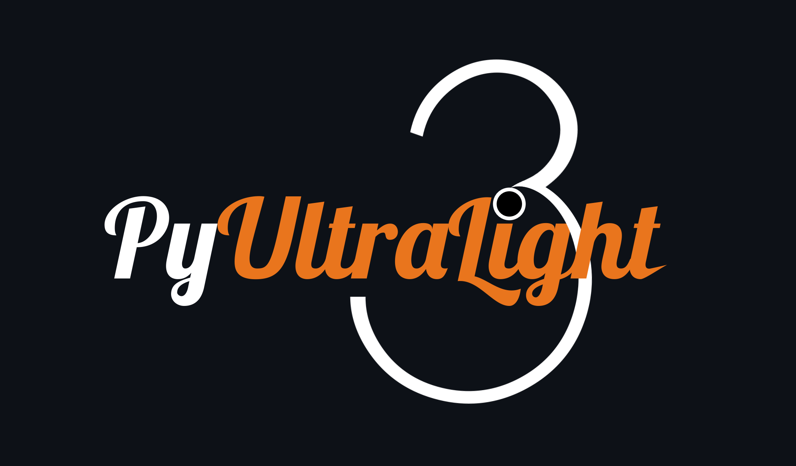

For a long time I was thinking why the repo name didn't have the number 2 in it...

Presenting PyUL3 "BHAccretion". Realistic momentum transfer from wavefunction to one massive perturber. Final stages of testing ahead of a new Dynamical Friction paper.

**This version:** Yourong F. Wang 

Sifyrena.github.io

FWPhys.com

**Original PyUltraLight Team at Auckland Cosmology **

Edwards, F., Kendall, E., Hotchkiss, S. & Easther, R. 

arxiv.org/abs/1807.04037

